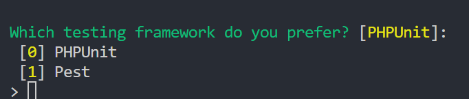

## Apa itu Framework?
 <i>Kerangka kerja</i> atau <i>tools</i> yang digunakan untuk mempercepat dalam proses pengembangan suatu aplikasi

Ilustrasi :


Dengan adanya <i>framework</i> kita tidak perlu membangun aplikasi dari <i>scratch</i> kita hanya perlu mempelajari struktur dari framework tersebut.
<hr style="border-top:1px solid #ccc">

##  Apa itu Laravel
Laravel merupakan framework PHP yang open-source, expressive dan syntax nya elegant


## Why Laravel ? 
- Mempercepat waktu pengembangan aplikasi 
- Performa aplikasi yang lebih baik
- Komunitas yang luas

## Release Information 
Laravel versi 11 di rilis pada 12 Maret 2024 


## Apa yang baru di Laravel 11?
 Laravel 11 merupakan pengembangan dari  laravel versi 10.x . Fokus pengembanganya antara lain:
 - Struktur Aplikasi yang lebih rapi dan mudah bagi pemula
 - health routing
 - new artisan commands
 - queue testing
 - dan lainnya


Oleh karena itu, framework laravel merupakan <i>best choice</i> untuk membangun aplikasi web yang modern dan full stack.
<hr style="border-top:1px solid #eee">

## Installasi
Sekarang kita akan mulai ke step installasi laravel di device kita.

Pastikan kalian memiliki PHP dan Composer yang sudah terinstall

Untuk install composer bisa klik link dibawah ini :<br>
https://getcomposer.org/


Note:
```
Composer merupakan tool untuk dependency management di PHP
```
```
Dependency management berarti untuk mengatur library yang digunakan dalam project kita (install/update)
```

Setelah PHP dan Composer terinstall, lanjut kita bikin project laravel baru  via terminal atau command dengan perintah Composer seperti dibawah:
```
composer create-project laravel/laravel laravel-part1
```
atau kita install secara <b>global</b> agar nanti kita tidak perlu ulangi prosesnya setiap buat project caranya yaitu:

```
composer global require laravel/installer
```
Ketika di run di terminal maka composer akan load package untuk laravel/installer seperti dibawah:


kalo sudah sekarang untuk membuat project baru kita bisa ketik perintah seperti dibawah:
```
laravel new laravel-part1
```
Pilih starter kit [No Starter kit]


Untuk testing framework pilih :PHPUnit


Pilih database dari aplikasi yang digunakan


Jika berhasil maka kalian bisa buka folder project laravel yang sudah dibuat tadi menggunakan terminal atau command:
```
cd laravel-part1
```

lalu jalankan menggunakan Artisan serve  dengan command dibawah:
```
php artisan serve
```

Setelah itu kalian akan diarahkan oleh browser menuju aplikasi web kalian yang bisa di akses di <a href="http://localhost:8000" style="color:red;">http://localhost:8000</a>

Horee! Aplikasi kalian sudah bisa diakses sekarang

## Struktur Folder
Dibawah ini merupakan struktur folder dari project laravel 11:


 ## Penjelasan File Env
 Dalam project laravel terdapat file .env yang digunakan untuk setup koneksi database, judul app, email configuration dll
 ```.env
 APP_NAME=Laravel
APP_ENV=local
APP_KEY=base64:m7bqiEHHK/g2bvNpU85P5d5L9uaTSsZ/fPmkay+ea8o=
APP_DEBUG=true
APP_URL=http://localhost

LOG_CHANNEL=stack
LOG_DEPRECATIONS_CHANNEL=null
LOG_LEVEL=debug

DB_CONNECTION=mysql
DB_HOST=127.0.0.1
DB_PORT=3306
DB_DATABASE=laravel_part1
DB_USERNAME=root
DB_PASSWORD=
 ```
 ## Stuktur MVC  Dalam Laravel
 
Arsitektur yang digunakan pada framework laravel yaitu Model View Controller. Untuk mengetahui lebih detail penjelasan nya seperti berikut:
 - Controller: Berfungsi sebagai jembatan yang menghubungkan model dan view. Menerima request dan mengirimkan responnya kembali ke user.
 - Model: Berfungsi untuk <i>manage</i> data pada database seperti membuat query untuk get , insert , update dan delete data.
 - view: Berfungsi sebagai tampilan atau UI pada halaman web.

Untuk lebih mudah kita dapat melihat ilustrasi pada gambar dibawah ini:


Nah sekarang sudah pahamkan mengenai arsitektur pada framework laravel . 

Kemudian kita akan mempelajari bagaimana sih implementasi arsitektur tersebut pada laravel.

## Sebelum Membuat Kode program php
Kita butuh extension yang di install pada vs code kita yaitu:


- Php Intelliphense : Fitur Autocomplete untuk kode php 


## Dasar Route
Route merupakan rute atau tujuan pada suatu halaman website. 

ketika user mengirim kan request dengan menggunakan HTTP Method maka laravel hanya membolehkan route yang sudah di definisikan agar request tersebut bisa diteruskan ke controller.

Contoh Route 
<table>
<tr>
    <th>Http Method</th>
    <th>URI</th>
</tr>
<tr>
<td>GET</td>
<td>blog/index</td>
</tr>
<tr>
<td>GET</td>
<td>blog/detail?id=1</td>
</tr>
<tr>
<td>POST</td>
<td>blog/add</td>
</tr>
<tr>
<td>PUT</td>
<td>blog/update</td>
</tr>
<tr>
<td>DELETE</td>
<td>blog/delete?id=1</td>
</tr>
</table>

Untuk mengatur route silahkan buka file web.php di ``routes/web.php ``

```php
Illuminate\Support\Facades\Route;
// fungsi dibawah merupakan closure yang dapat mengembalikan suatu nilai
Route::get('/', function () {
    return view('welcome');
});

```
Penjelasan:
- Route : class Route yang di import dari ``
use Illuminate\Support\Facades\Route;`` digunakan agar bisa mengakses fungsi  HTTP Method dan URI atau halaman yang dituju
- Function get didefinisikan static makanya kita tidak perlu buat object . Kita bisa langsung panggil fungsinya seperti syntax diatas ``ClassName::staticMethod();
``

## Artisan
Artisan merupakan perintah command line yang terdapat pada framework laravel yang digunakan untuk membantu kita untuk generate file, database migration,clear cache, menjalankan aplikasi dll.

untuk mengetahui perintah pada artisan console , silahkan ketik perintah dibawah:
```php artisan list```

##  Dasar Controller
Controller merupakan bagian yang menghandle request dari route yang sudah didefinisikan lalu mengembalikan response bisa berupa tampilan atau View dan Data.

### Membuat Controller menggunakan perintah artisan
Ketik perintah dibawah untuk membuat controller:
``php artisan make:controller BlogPostController``

jika berhasil maka kita akan buat fungsi utama dari suatu controller yaitu index. 

Fungsi index akan dibuka ketika user membuka halaman blogpost.

Perhatikan kode program dibawah:
```php
namespace App\Http\Controllers;
 
use App\Models\User;
use Illuminate\View\View;
 
class BlogPostController extends Controller
{
    /**
     * Show the blog post page with return view
     */
    public function index(): View
    {
        // disini kita ingin membuat tampilan halaman index pada folder blog
        return view("blog.index");
    }
}

```

## Definisikan View
 View digunakan untuk menampilkan UI yang sudah di definisikan di controller. Halaman view terdapat pada folder ``resources/views``

 Jika folder blog belum ada maka kita bisa buat folder blog dengan perintah artisan dibawah:
 ```php artisan make:view blog/index```

 Setelah itu kita isi content di halaman index nya seperti dibawah ya:
 ```html
 <h1>Hello World</h1>
 ```
## Definisikan Route dari implementasi diatas
Isi file dari web.php sekarang yaitu:
```php
Route::get("/blog/index",[BlogPostController::class,'index']);
```

Jika sudah kita bisa jalankan laravel kita dengan perintah dibawah:
```php artisan serve```


